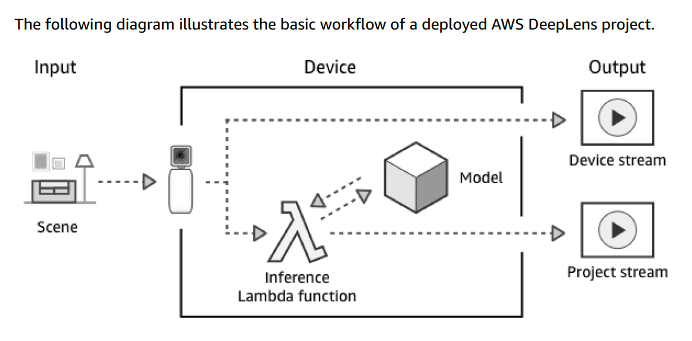

# Smile Detection in Real Time Video Feed
The goal of the project is to build a convolutional neural network (CNN) that can predict if a person is smiling in real-time.
## Dataset Overview
The dataset used for this project comes from the following repo ([hromi/SMILEsmileD](https://github.com/hromi/SMILEsmileD)). The SMILE dataset consists of tightly cropped grey-scale photos.

The repo can be cloned to your local machine with the following command
```
git clone https://github.com/hromi/SMILEsmileD.git
```

## Project Architecture
Below is a visual project flow utilizing the Deep Lens and accompanying AWS ecosystem for inference.

## Model Architecture
This project utlizes Tensorflow (specifically Keras) for the construction and training of the CNN. The CNN consists of the following architecture:  
  

## Secret Management
This repo utilizes github actions for automatically pushing a new version of the labmda function to AWS. The actions pipeline will decrypt the `config.gpg` file based on a secret called `CREDS_PASSPHRASE` that you must store in `settings/secrets` within the repo. The credentials in the file can then be utilized in the code to push the new version to AWS. The `config` file must look like this:

```bash
[default]
aws_access_key_id=your_key_id_here
aws_secret_access_key=your_secret_access_key
region=us-east-1
```

The `config` file is listed in the gitignore file so that it's not accidentally checked into version control. Once you have the necessary secrets in the `config` file, run the follow command to encrypt it:

```bash
gpg --symmetric --cipher-algo AES256 config
```
You'll be prompted to enter a passphrase. Make sure to put that passphrase as a secret within the repo as mentioned above so that it can be decrypted in the pipeline. When the `config` file is decrypted in the pipeline, it is loaded to `$HOME/.aws` so that the AWS cli tools can utilize it.  

## Part 1: Dataset  
The first part of this project consisted of organizing the dataset into a structure that was easy for training. The full notebook can be found [here](notebooks/smile_detection_01.ipynb).  

## Part 2: Pre-Processing & Modeling  
The second section of the project deals with pre-processing the images and building the CNN model. The full notebook can be found [here](notebooks/smile_detection_02.ipynb).  

## Part 3: Testing  
The third (and minor) section includes a small test on two photos. The test can be found [here](notebooks/smile_detection_03.ipynb).
